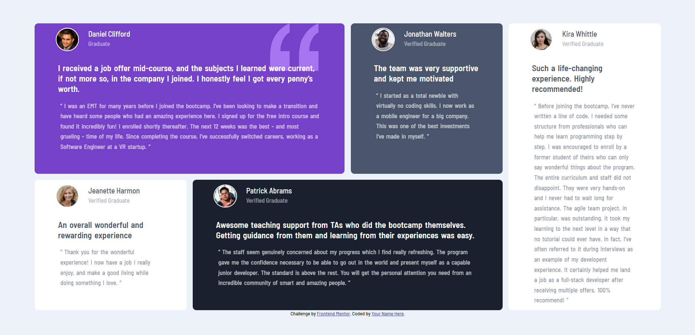

# Frontend Mentor - Testimonials grid section solution

This is a solution to the [Testimonials grid section challenge on Frontend Mentor](https://www.frontendmentor.io/challenges/testimonials-grid-section-Nnw6J7Un7). Frontend Mentor challenges help you improve your coding skills by building realistic projects. 

## Table of contents

- [Overview](#overview)
  - [The challenge](#the-challenge)
  - [Screenshot](#screenshot)
  - [Links](#links)
- [My process](#my-process)
  - [Built with](#built-with)
  - [What I learned](#what-i-learned)
  - [Continued development](#continued-development)
  - [Useful resources](#useful-resources)
- [Author](#author)
- [Acknowledgments](#acknowledgments)

## Overview

### The challenge

Users should be able to:

- View the optimal layout for the site depending on their device's screen size

### Screenshot

### Links

- Solution URL: [repo](https://github.com/JimCarey08/Grid-Testimonials-FrontEndMentor)
- Live Site URL: [Live site](https://jimcarey08.github.io/Grid-Testimonials-FrontEndMentor/)

## My process

### Built with

- Semantic HTML5 markup
- CSS custom properties
- Flexbox
- CSS Grid
- Mobile-first workflow

### What I learned

I can put on practice more of the grid resource of css, and learned how to do the layout using multiples columns and learned the grid-gap.

### Continued development

I need to organize better my css file, for better reading and updating-it, dividing sections on him...

### Useful resources

- [Grid video from kevin powell](https://www.youtube.com/watch?v=rg7Fvvl3taU&t=45s) - This helped me for a better understanding of the grid resource, and his atributes.

## Author

- Frontend Mentor - [@JimCarey08](https://www.frontendmentor.io/profile/JimCarey08)
- Twitter - [@LucasViCoisas](https://www.twitter.com/LucasViCoisas)

## Acknowledgments

When you don't want to code, go and code.... You will lean a lot doing this....

